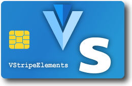

# VStripeElements

[](https://travis-ci.org/morphatic/v-stripe-elements)
[](https://coveralls.io/github/morphatic/v-stripe-elements?branch=master)


[](http://commitizen.github.io/cz-cli/)

A set of Vue components that styles [Stripe Elements](https://stripe.com/payments/elements) to match the [Vuetify UI library](https://vuetifyjs.com).

<p align="center"></p>

Check out a [working demo on CodePen](https://codepen.io/morphatic/pen/OJLjgZd).

[](https://ko-fi.com/W7W610G7B)

## Installation and Configuration

From the root of a Vue project already using Vuetify:

```bash
npm i -S v-stripe-elements
```

Then in the `.env` file in the root of your project:

```sh
VUE_APP_STRIPE_API_KEY=pk_live_4eC39HqLyjWDarjtT1zdp7dc
```

Optionally, add your test key to `.env.local`. This will automatically use the test key when doing local development and testing.

```sh
VUE_APP_STRIPE_API_KEY=pk_test_4eC39HqLyjWDarjtT1zdp7dc
```

🚨 **CAUTION**: Do **NOT** use your Stripe secret key with this component (i.e. keys that begin with `sk_live_...` or `sk_test_...`). This would expose your secret key publicly and potentially give other people the ability to do Bad Things™. Should you accidentally expose your secret keys, strongly consider [rolling your API keys](https://stripe.com/docs/keys#keeping-your-keys-safe).

## Basic Usage

Within a Vue template:

```vue
<template>
  <v-stripe-card
    v-model="source"
    :api-key="process.env.VUE_APP_STRIPE_API_KEY"
  ></v-stripe-card>
</template>

<script>
  import { VStripeCard } from 'v-stripe-elements'
  export default {
    components: {
      VStripeCard
    },
    data: () => ({
      source: null
    })
  }
</script>
```

## Description

`VStripeInput` extends [Vuetify's `VTextField` component](https://vuetifyjs.com/en/components/text-fields). That means it inherits and shares the look and feel of all of Vuetify's other form inputs and controls. It supports all of the built-in themes, styles, and props you expect if using the Vuetify UI library.

## Props

|       Name       |       Type      |  Default  | Required? | Description                                                                                                                                                                                                                                                  |
|:----------------:|:---------------:|:---------:|:---------:|--------------------------------------------------------------------------------------------------------------------------------------------------------------------------------------------------------------------------------------------------------------|
|     `apiKey`     |     `string`    |   `null`  |    yes    | Your Stripe **public** API key. It should start with `pk_`. Do NOT use your secret key here. [See the Stripe docs for more info](https://stripe.com/docs/keys).                                                                                              |
|     `create`     |     `string`    |  `token`  |     no    | Determines whether the control will [create a token](https://stripe.com/docs/stripe-js/reference#stripe-create-token) (e.g. for single use) or [create a source](https://stripe.com/docs/stripe-js/reference#stripe-create-source) (e.g. for multiple uses). |
|   `customStyle`  |     `object`    |    `{}`   |     no    | Allows you to override the default styles. [Editable properties are described here](https://stripe.com/docs/stripe-js/reference#element-options).                                                                                                            |
|    `fontName`    |     `string`    |  `Roboto` |     no    | The name of the font you want the component to use, as it would appear in CSS, e.g. `Open Sans`. Any [font name available on Google fonts](https://fonts.google.com/) is acceptable.                                                                         |
|     `fontUrl`    |     `string`    |    `''`   |     no    | This is only necessary if the URL from which the font should be retrieved is NOT the default you would get from Google fonts, e.g. if you wanted to use a heavier or lighter weight or if it was served from another domain.                                 |
|    `hideIcon`    |    `boolean`    |  `false`  |     no    | If `true`, hides the credit card icon inside the input.                                                                                                                                                                                                      |
| `hidePostalCode` |    `boolean`    |  `false`  |     no    | Hides the postal code entry segment of the input. Only set this to `true` if collecting the postal code separately and passing it to the input.                                                                                                              |
|    `iconStyle`   | `default|solid` | `default` |     no    | Allows selecting one of the two icon styles provided by Stripe.                                                                                                                                                                                              |
|     `options`    |     `object`    |    `{}`   |     no    | Additional metadata that can be passed to `createToken()` or `createSource()` as described in the Stripe Elements documentation. See below for examples.                                                                                                     |
|       `zip`      |     `string`    |    `''`   |     no    | If passing the postal (zip) code in from outside the input, i.e. from another input.                                                                                                                                                                         |

## Slots

Supports all of the same slots available for [`VTextField`](https://vuetifyjs.com/en/components/text-fields#api) **_except the default slot_**. The default slot is overwritten by Stripe.

## Events

It _should_ support all of the same events as `VTextField`. Event support has not been thoroughly tested. [Bug reports are welcome](https://github.com/morphatic/v-stripe-elements/issues).

By default, the component listens for `change` events. When the user has entered enough information to be considered "complete," the component will make a request to Stripe and attempt to validate the card. If successful, the generated `token` or `source` object will be emitted by the `input` event. The typical way to intercept this is to set the `v-model` prop on the component, to which the `token` or `source` object will be automatically assigned.

## Loading Stripe

This component relies upon the [Stripe.js library](https://stripe.com/docs/stripe-js/reference) which is designed for use in browser clients or SPAs (single-page apps). As such, Stripe.js must be loaded into the browser before the component can be initialized. There are two ways this can be accomplished:

### Loading Stripe via `<script>` Element

The easiest and most reliable way to load Stripe is to add a `<script>` element to the `<head>` section of your page. In a typical Vue project, this would be in `public/index.html`. It would look something like:

```html
<!DOCTYPE html>
<html lang="en">
  <head>
    <meta charset="utf-8">
    <meta http-equiv="X-UA-Compatible" content="IE=edge">
    <meta name="viewport" content="width=device-width,initial-scale=1.0">
    <link rel="icon" href="<%= BASE_URL %>favicon.ico">
    <link href="https://fonts.googleapis.com/css?family=Roboto:100,300,400,500,700" rel="stylesheet">
    <title>My Awesome Site</title>
    <script src="https://js.stripe.com/v3/"></script><!-- <== Stripe loaded HERE -->
  </head>
```

Also note that this is a good place to load any external fonts you'd like to include, but this is not strictly necessary.

### Loading Stripe Using `vue-plugin-load-script`

When the component is being mounted, it looks for the `Stripe` function in the global scope (i.e. `window.Stripe`). If not found, it will next check to see if [`vue-plugin-load-script`](https://www.npmjs.com/package/vue-plugin-load-script) is available in your project and attempt to load Stripe on the fly. To make the script loader available you should first install it in your project:

```bash
# npm
npm install --save-dev vue-plugin-load-script

# yarn
yarn add --dev vue-plugin-load-script
```

Then wherever you initialize Vue (usually `src/main.js` in Vue-CLI projects), import and register the script loader plugin:

```js
// src/main.js
import LoadScript from 'vue-plugin-load-script'

Vue.use(LoadScript)
```

The benefit of loading Stripe in this way is that if it is only needed rarely in your app, you avoid having to load Stripe on every page load as with the first method. It will be loaded on demand as needed.

## Usage in the Browser

While in general it is expected that this component will be used primarily in webpack-based projects, it is possible to use it directly in the browser. Just load the JS and CSS files along with Vue and Vuetify:

```html
<!DOCTYPE html>
<html lang="en">
  <head>
    <meta charset="utf-8">
    <meta http-equiv="X-UA-Compatible" content="IE=edge">
    <meta name="viewport" content="width=device-width,initial-scale=1.0">
    <link href="https://fonts.googleapis.com/css?family=Roboto:100,300,400,500,700,900" rel="stylesheet">
    <link href="https://cdn.jsdelivr.net/npm/@mdi/font@3.x/css/materialdesignicons.min.css" rel="stylesheet">
    <link href="https://cdn.jsdelivr.net/npm/vuetify@2.0.11/dist/vuetify.min.css" rel="stylesheet">
    <link href="https://cdn.jsdelivr.net/npm/v-stripe-elements@latest/dist/v-stripe-elements.min.css" rel="stylesheet">
    <title>My Awesome Site</title>
    <script src='https://cdn.jsdelivr.net/npm/babel-polyfill/dist/polyfill.min.js'></script>
    <script src="https://js.stripe.com/v3/"></script>
    <script src="https://cdn.jsdelivr.net/npm/vue@2.x/dist/vue.js"></script>
    <script src="https://cdn.jsdelivr.net/npm/vuetify@2.0.11/dist/vuetify.min.js"></script>
    <script src="https://cdn.jsdelivr.net/npm/v-stripe-elements@latest/dist/v-stripe-elements.min.js"></script>
    <script>
      new Vue({
        el: '#app',
        vuetify: new Vuetify(),
        data: () => ({
          token: null
        })
      })
    </script>
  </head>
  <body>
    <div id="app">
      <v-app id="inspire">
        <v-stripe-card
          v-model="token"
          api-key="pk_live_012340u45"
        ></v-stripe-card>
      </v-app>
    </div>
  </body>
</html>
```

## Disclaimer

As it says in [the license](/LICENSE), "THE SOFTWARE IS PROVIDED "AS IS", WITHOUT WARRANTY OF ANY KIND." In other words, if you're collecting sensitive information from your users, you should know what you're doing.

## Questions, Comments, Bug Reports, etc.

Comments, questions, pull requests, and bug reports are very welcome. Please [submit an issue](https://github.com/morphatic/v-stripe-elements/issues) via the Issues tab above.

Have fun!
